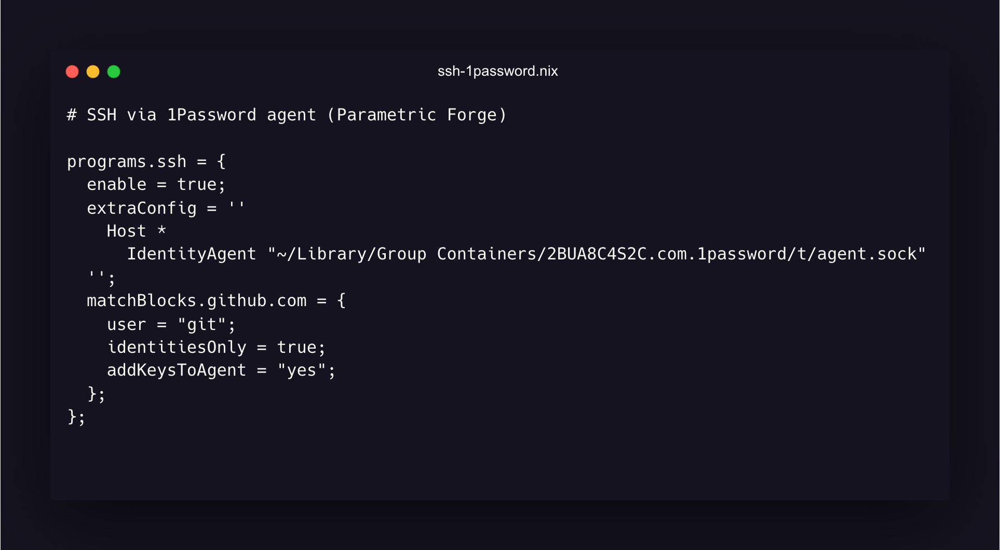
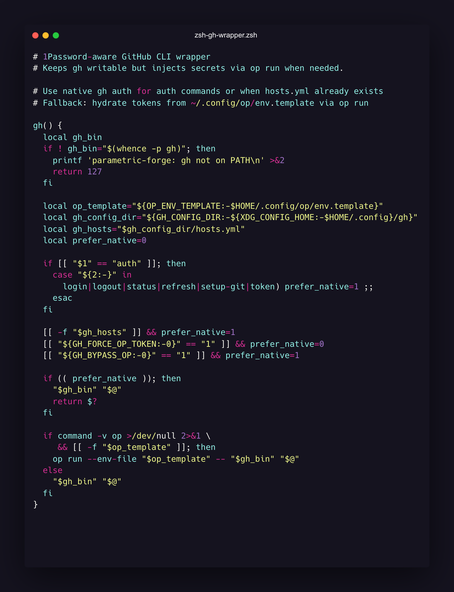
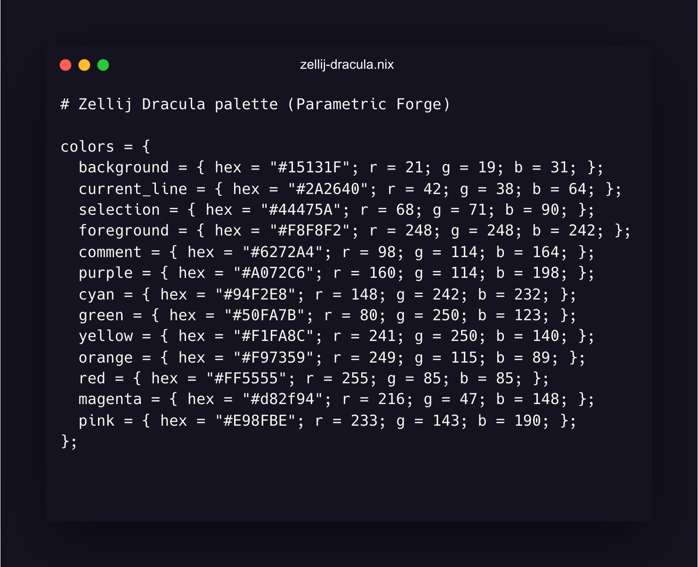
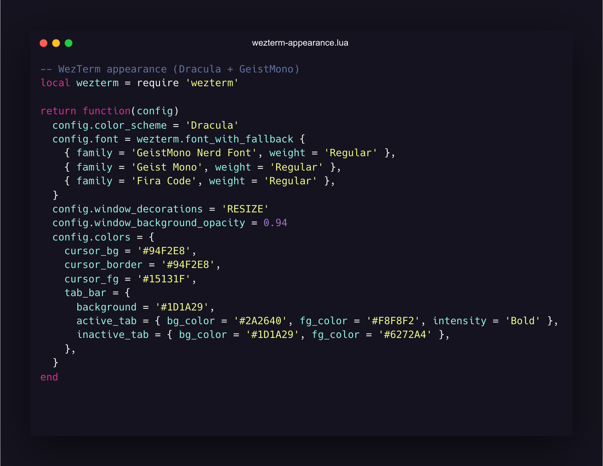
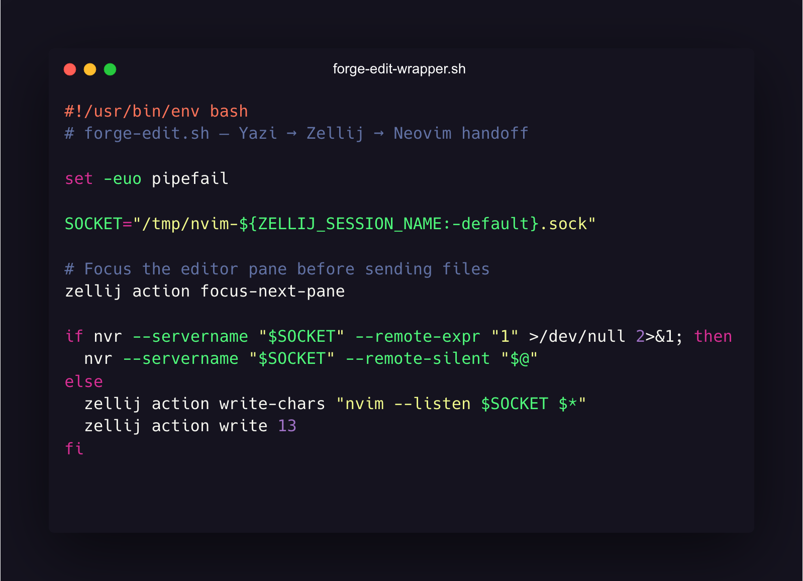

# Parametric Forge

<div style="padding: 8px 0 12px;">
  
  
  
  
  
  
  
</div>

Parametric Forge is a deterministic macOS workspace built with Nix flakes, nix-darwin, and Home Manager. It targets computational design (Rhino/Grasshopper/BIM), heavy media, and modern development stacks with reproducible tooling, tuned defaults, and strict XDG hygiene.

<div style="padding: 12px 14px; border: 1px solid #1f2937; border-radius: 12px; background: #0b111a;">
  <strong>At a glance</strong>
  <ul style="margin: 0 0 0 18px;">
    <li><strong>Scope:</strong> One flake drives macOS defaults, GUI apps, CLI tools, fonts, overlays (Yazi + sqlean), and cache policy.</li>
    <li><strong>Secrets:</strong> 1Password-backed secrets + SSH keep credentials out of the repo; GitHub CLI stays writable.</li>
    <li><strong>Terminal mesh:</strong> WezTerm → Zellij → Yazi with Neovim remote control, Starship, Atuin, fzf-tab, and carapace.</li>
    <li><strong>Toolchains:</strong> Python 3.13 (uv/ruff/mypy), Node (nix + pnpm), Lua + LSPs, SQLite/duckdb with sqlean/spatialite/vec, dotnet 8 for Rhino.</li>
    <li><strong>Assets:</strong> CAD/BIM/media formats stay versionable via LFS defaults; ffmpeg/imagemagick tuned for previews.</li>
  </ul>
</div>

---

## Layout
```text
.
├── flake.nix / flake.lock          # Inputs/outputs, overlay export, devshell, formatter
├── hosts/
│   └── darwin/default.nix          # MacBook host: nix-darwin + nix-homebrew + Home Manager
├── modules/
│   ├── common/                     # Nix daemon perf/cache + Cachix post-build hook
│   ├── darwin/                     # macOS defaults, fonts, homebrew taps/brews/casks/whalebrew
│   └── home/                       # Home Manager: XDG, env, aliases, programs, scripts, assets
│       ├── assets/                 # ASCII + carbon sources/renders
│       ├── environments/           # Session vars for shell/languages/media/secrets/containers
│       ├── programs/               # Apps (wezterm/zellij/yazi), shell-tools, git-tools, nix-tools, zsh
│       ├── scripts/                # Integration wrappers (nvim/zellij/yazi)
│       └── xdg.nix                 # XDG base dirs + scaffolding
├── overlays/                       # Upstream Yazi overlay passthrough + custom sqlean
└── .archive/                       # Retired configs kept for reference
```

---

## Quick Start
1. **Install Nix (Determinate):**
   ```sh
   curl --proto '=https' --tlsv1.2 -sSf -L https://install.determinate.systems/nix | sh -s -- install
   ```
2. **Sign into 1Password CLI:**
   ```sh
   op signin <account>
   ```
3. **Clone:**
   ```sh
   git clone https://github.com/bsamiee/Parametric_Forge.git ~/Parametric_Forge
   ```
4. **Apply mac host:**
   ```sh
   nix run nix-darwin -- switch --flake ~/Parametric_Forge#macbook
   ```
5. **Rebuild after edits:**
   ```sh
   darwin-rebuild switch --flake ~/Parametric_Forge#macbook
   ```

---

## Secrets + SSH
- **Secret references:** `modules/home/environments/secrets.nix`; template written by `modules/home/xdg.nix` to `~/.config/op/env.template`.
- **Invocation:** `op run --env-file ~/.config/op/env.template -- <command>` keeps secrets out of git.
- **SSH agent:** `modules/home/programs/shell-tools/ssh.nix` points to `~/Library/Group Containers/2BUA8C4S2C.com.1password/t/agent.sock`.
- **GitHub CLI:** stays writable because `~/.config/gh` is unmanaged by Home Manager.

---

## Terminal Mesh (WezTerm ↔ Zellij ↔ Yazi ↔ Neovim)
- **WezTerm:** Lua modules (`modules/home/programs/apps/wezterm`) split appearance/keys/mouse/behavior/integration; auto-attaches to Zellij sessions.
- **Zellij:** `modules/home/programs/apps/zellij` ships Dracula palette, layouts, and `zjstatus`; one color map reused by theme and plugins.
- **Yazi:** `modules/home/programs/apps/yazi` themed to match; wrapper scripts (`modules/home/scripts/integration/zellij`) set `EDITOR=forge-edit.sh` so Yazi hands edits to Neovim.
  - `forge-edit.sh` uses per-session nvr sockets; WezTerm focuses the adjacent pane before sending files.
- **Shell:** Zsh with fzf-tab, Atuin history, carapace completions, Starship, zoxide, delta pager; session paths/XDG caches tuned in `modules/home/environments/*`.

---

## Tooling Suite
<div style="padding: 12px 14px; border: 1px solid #1f2937; border-radius: 12px; background: #0b111a;">
  <details>
  <summary>Nix, hosts, cache</summary>

  - **Daemon:** `modules/common/nix.nix` tunes eval/build parallelism, HTTP/2, cache TTLs, and post-build Cachix push.
  - **Overlay:** `overlays/default.nix` forwards upstream Yazi overlay and adds `sqlean` SQLite extensions.
  - **Host binding:** `hosts/darwin/default.nix` wires nix-darwin, Home Manager, nix-homebrew, and user state versions.
  </details>

  <details>
  <summary>Git + security</summary>

  - **VCS stack:** Delta pager everywhere, LFS patterns for CAD/BIM/media, lazygit, gitleaks, git-quick-stats (`modules/home/programs/git-tools`).
  - **SSH:** Multiplexing + sockets in `~/.ssh/sockets`; 1Password agent for keys.
  </details>

  <details>
  <summary>Languages</summary>

  - **Python:** 3.13 stack with uv, ruff, mypy; caches under XDG (`modules/home/environments/languages.nix`).
  - **Node/Lua/DB:** Node via nix + pnpm (npm is aliased to pnpm for consistency); Lua + LSP tooling; DuckDB/SQLite with sqlean/spatialite/vec (`modules/home/programs/languages/*`).
  </details>

  <details>
  <summary>Media + documents</summary>

  - **Tooling:** ffmpeg, imagemagick, resvg, chafa, mediainfo, ocrmypdf, pandoc with cache/log paths under XDG.
  - **Config:** Environment knobs in `modules/home/environments/media.nix`.
  </details>

  <details>
  <summary>Homebrew bridge</summary>

  - **Bridge:** `modules/darwin/homebrew` enables nix-homebrew, auto-update/cleanup, and installs taps/brews/casks/whalebrew (Raycast, BTT, Arc, Adobe CC, fonts not in nixpkgs, yabai/skhd/borders).
  </details>
</div>

---

## Code Examples


**SSH via 1Password agent:**

  

**Zsh gh wrapper with 1Password:**

  

**Zellij Dracula palette:**

  

**WezTerm appearance:**

  

**Forge edit/yazi integration:**

  

---

## Maintenance
<div style="padding: 12px 14px; border: 1px solid #1f2937; border-radius: 12px; background: #0b111a;">
  <ul style="margin: 0 0 0 18px;">
    <li><strong>Format:</strong> <code>nix fmt</code></li>
    <li><strong>Dev shell + lint:</strong> <code>nix develop</code> → <code>deadnix .</code>, <code>statix .</code></li>
    <li><strong>Rebuild host:</strong> <code>darwin-rebuild switch --flake ~/Parametric_Forge#macbook</code></li>
    <li><strong>Update inputs:</strong> <code>nix flake update</code></li>
    <li><strong>Cache push:</strong> automatic via post-build hook when <code>CACHIX_AUTH_TOKEN</code> is present</li>
  </ul>
</div>

## License
MIT © [Bardia Samiee](https://github.com/bsamiee)
